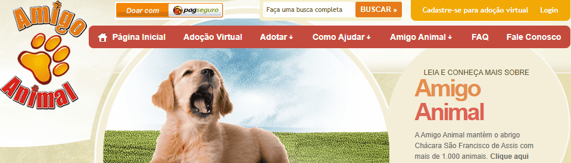

# Projeto com README
Um projeto de teste com um arquivo README 

[](https://amigoanimal.org.br/)

## Tecnologias utilizadas 
- HTML
- CSS
- JS

## Como utilizar

1 - Faça o clone do projeto
```
git clone <url>
```

2 - Acesse a pasta do projeto
```
cd repositorio-com-readme
```


